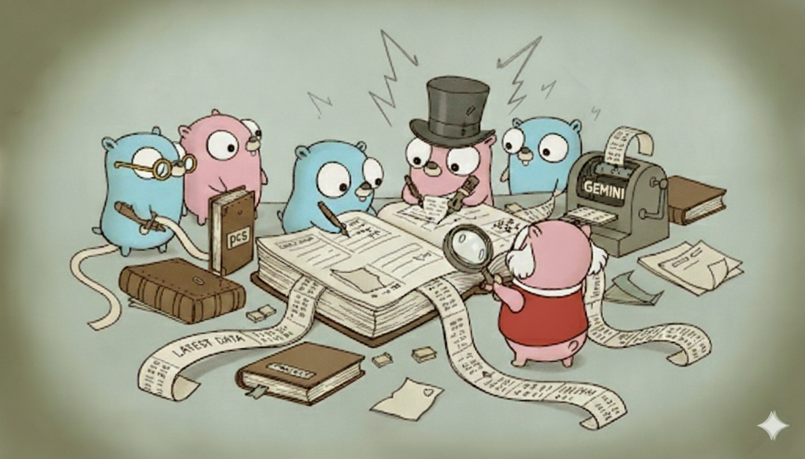

[](https://pkg.go.dev/github.com/etnz/portfolio)

# pcs: Your Private, Unified Portfolio Tracker


In a world where your investments are scattered across multiple platforms—from corporate savings plans and retirement accounts to various online brokers—getting a single, clear view of your financial health is a challenge. `pcs` is a local-first, command-line tool designed to solve this problem by providing a unified, private, and auditable view of your entire investment portfolio.

## The Challenge: A Scattered Portfolio

Many of us have assets spread across a variety of disconnected accounts:

*   **Corporate Savings Plans:** Often managed by specific institutions and not easily tracked in standard brokerage accounts.
*   **Retirement Plans:** Typically held in separate, dedicated accounts.
*   **Corporate Stock Options:** Managed by a specific broker, adding another silo to your portfolio.
*   **Online Trading Platforms:** Modern online banks and trading platforms that offer stock and crypto trading.
*   **Traditional Life Insurance:** Held in a traditional bank, with its own interface and reporting.

This scattered landscape makes it incredibly difficult to answer a simple question: "What is my total net worth, and how is it performing?"

## The Solution: A Unified, Private Portfolio

`pcs` allows you to bring all your assets into a single view, giving you a clear picture of your entire portfolio. The tool is designed to handle both publicly-traded stocks and private, hard-to-track assets, like corporate savings plans or even real estate. Because `pcs` is a local-first tool that operates on your own machine, you have complete privacy and control over your financial data.

## Getting Started: Your First Unified Portfolio

This tutorial will walk you through the process of setting up your portfolio and tracking your first investment.

### Installation

To get started, ensure you have Go installed on your system. Then, you can install `pcs` with a single command:

```bash
go install github.com/etnz/portfolio/cmd/pcs@latest
```

### Declaring Your Assets

Before you can track an asset, you need to know exactly what asset you want to track.
For instance Apple's stocks can be exchanged in USD on the Nasdaq, but also as EUR
on the XETRA exchange.

Let's declare a public stock (Apple) and a private fund in your corporate savings plan.
declaring is given them a short mnemonic name to include all that identifying information
about the stock.


```bash run
pcs declare -d 2025-08-27 -s AAPL -id US0378331005.XETR -c EUR
```

```console check
Successfully appended transaction to transactions.jsonl
```

> [!NOTE]
> id uses Apple stock's ISIN followed by the exchange MIC code (XETR for XETRA). You can find this information on any financial websites. `pcs search-security Apple` can also help you find it.


Your corporate savings plan let you buy shares of funds that unfortunately are often not publicly traded. You can still track it by giving it a unique "private" identifier, and updating them manually (or by other tricks):

```bash run
pcs declare -d 2025-08-27 -s BankFund1 -id My-bank-Fund1 -c EUR
```

```console check
Successfully appended transaction to transactions.jsonl
```

> [!NOTE]
> -id is private identifier that identifies your bank's private fund.

Public securities will have their prices fetched automatically, while private securities will need to be updated manually or by using an data provider extension.


### Recording Transactions

Let's deposit some cash into your account.

```bash run
pcs deposit -d 2025-08-27 -a 10000 -c EUR
```

```console check
Successfully appended transaction to transactions.jsonl
```

 [!NOTE]
> In the whole documentation we always explicitly set the date for clarity, but the defaut date is usually correct.


Let's buy some Apple stock.

```bash run
pcs buy -d 2025-08-27 -s AAPL -q 10 -a 1500.0
```

```console check
Successfully appended transaction to transactions.jsonl
```

Let's record a buy in the corporate savings plan.

```bash run
pcs buy -d 2025-08-27 -s BankFund1 -q 100 -a 1200.0
```

```console check
Successfully appended transaction to transactions.jsonl
```


### Keeping Your Portfolio Up-to-Date

You can update the prices for your securities using the `price` command.

For publicly traded securities or assets you can get the latest prices automatically, which is very handy for daily updates. You would just run `pcs fetch <provider>`.

However for the purpose of this tutorial only, let's manually set the price for Apple stock to its closing price on 2025-08-27:

```bash run
pcs price -s AAPL -d 2025-08-27 -p 193.20
```

```console check
Successfully appended transaction to transactions.jsonl
```

For private assets, you have to manually update their price using the same command. Or write your own command to fetch prices from your bank's API if they provide one. Here we'll set the price for your corporate savings plan fund to its value on 2025-08-27:

```bash run
pcs price -s BankFund1 -d 2025-08-27 -p 11.23
```

```console check
Successfully appended transaction to transactions.jsonl
```


### The Payoff: Reporting

Now, you can see a unified view of your portfolio:

```bash run
pcs review -d 2025-08-27
```

```console check
# Review Report
  
  Daily Report for 2025-08-27
  
   **Total Portfolio Value** | **€10,355.00** 
  ---------------------------|----------------
              Previous Value |          €0.00 
                   Cash Flow |    +€10,000.00 
                   Net Gains |       +€355.00 
                             |                
              **Net Change** | **€10,355.00** 
                        Cash |     +€7,300.00 
              Counterparties |          €0.00 
                Market Value |     +€3,055.00 
  
  ## Cash Accounts
  
   **Cash Accounts** |     Value | Forex Return % 
  -------------------|-----------|----------------
                 EUR | €7,300.00 |         +0.00% 
  
  ## Holding View
  
   Asset     | Prev. Value |           Flow |         Gain |     End Value 
  -----------|-------------|----------------|--------------|---------------
   AAPL      |        0.00 |     +€1,500.00 |     +€432.00 |     €1,932.00 
   BankFund1 |        0.00 |     +€1,200.00 |      -€77.00 |     €1,123.00 
   **Total** |   **€0.00** | **+€2,700.00** | **+€355.00** | **€3,055.00** 
  
  ## Performance View
  
   Asset     |         Gain |    Return % 
  -----------|--------------|-------------
   AAPL      |     +€432.00 |       +Inf% 
   BankFund1 |      -€77.00 |       +Inf% 
   **Total** | **+€355.00** | **+41.85%** 
  
  ## Tax View
  
   Asset     |      Invested |  Realized |   Unrealized 
  -----------|---------------|-----------|--------------
   AAPL      |     €1,500.00 |     €0.00 |     +€432.00 
   BankFund1 |     €1,200.00 |     €0.00 |      -€77.00 
   **Total** | **€2,700.00** | **€0.00** | **+€355.00** 
  
  ## Transactions
  
   Date       | Type         | Description                                
  ------------|--------------|--------------------------------------------
   2025-08-27 | declare      | Declared AAPL as US0378331005.XETR in EUR  
   2025-08-27 | declare      | Declared BankFund1 as My-bank-Fund1 in EUR 
   2025-08-27 | deposit      | Deposited €10,000.00                       
   2025-08-27 | buy          | Bought 10 of AAPL for €1,500.00            
   2025-08-27 | buy          | Bought 100 of BankFund1 for €1,200.00      
   2025-08-27 | update-price | update-price                               
   2025-08-27 | update-price | update-price
```


## User Manual

For a detailed guide on all the features and commands, please refer to the [User Manual](./docs/readme.md).

## About This Project

This project is an exercise in using AI to generate code. The maintainer is using Gemini Code Assist as a full stack software engineer:
* the initial ontology (naming concepts, like ledger), project structure, CLI commands names, consistency accross function names.
* All design documents, and implementation plans.
* This readme (except this section)
* Github issues interactions. Most of the comments, many issues descriptions.
* All commit messages.
* All the code, including tests.